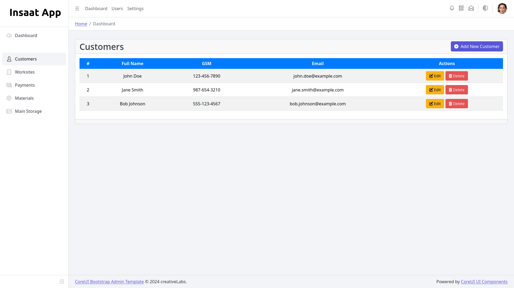
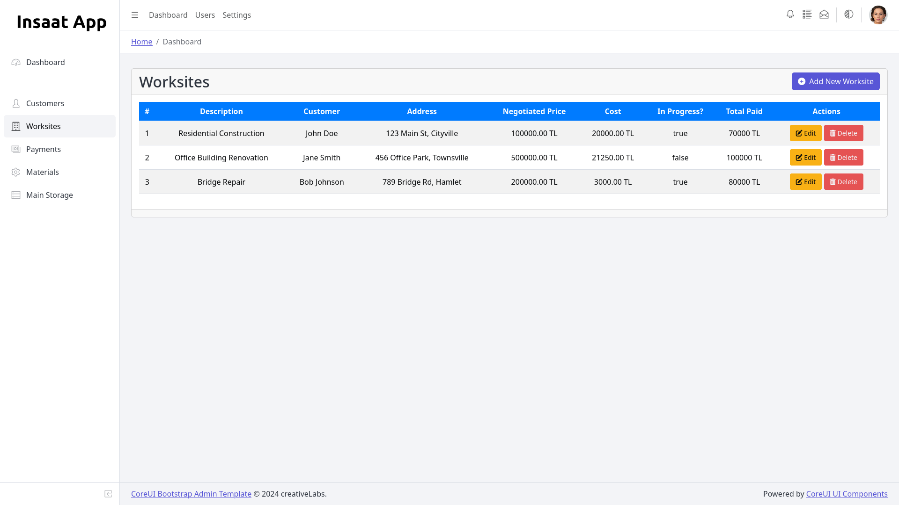
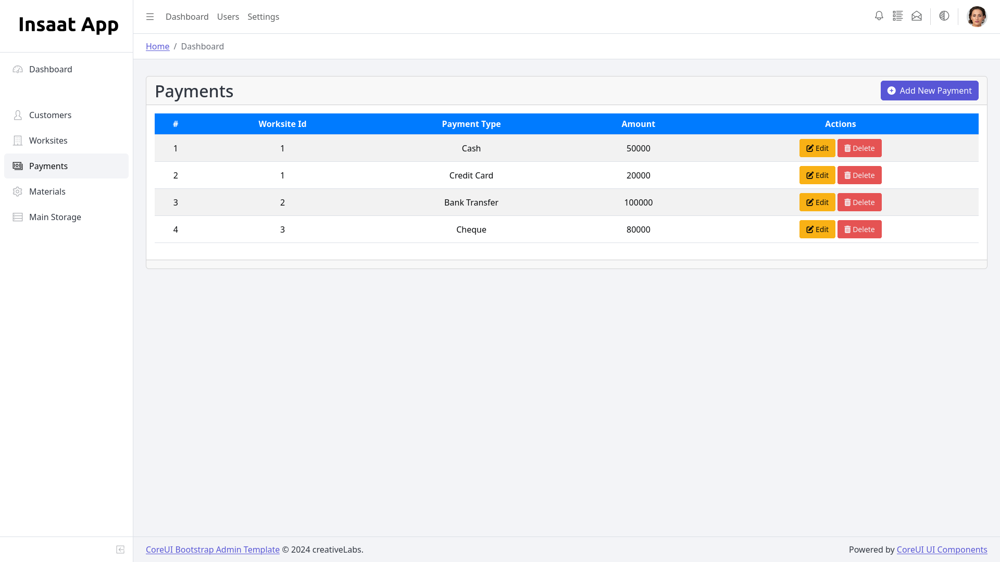
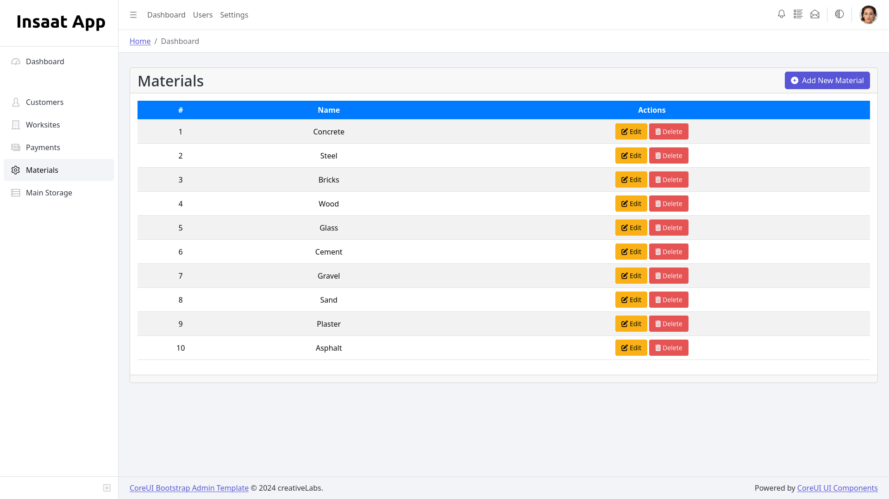
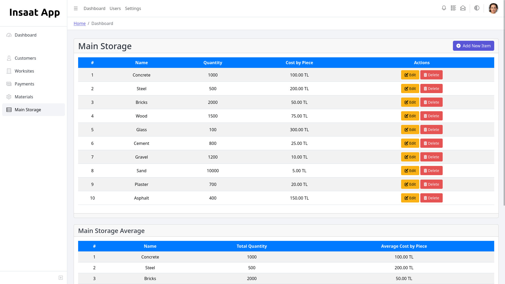
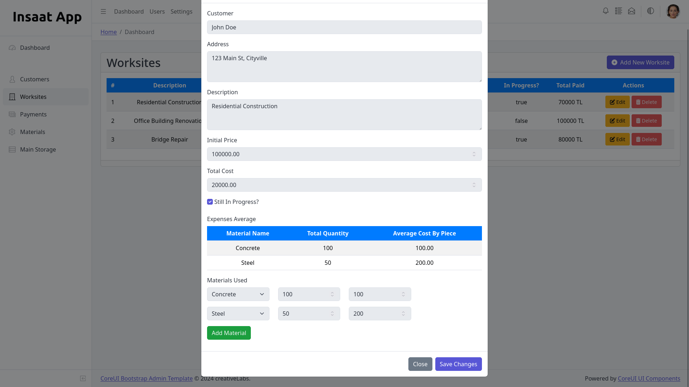

# Insaat App

## To Run
### initialize the database first
$ systemctl start mysql
$ chmod +x init.sql && ./init.sql

### run the project on your local machine
$ cd public && php -S localhost:8080

## Screenshots

